# awesome-midjourney

## Links

Logo: https://wgmimedia.com/midjourney-logo-prompts/

Get ideas: 

> https://bigsuricons.webflow.io
> https://icoicon.com
> https://icon.yukonga.top

## Prompts

the app icon featuring an image of a voice on the screen, in the style of qing dynasty, dark sky-blue and light white, storybook-esque, quadratura, minimalist graphic designer, tachisme, printed social commentary --ar 15:8

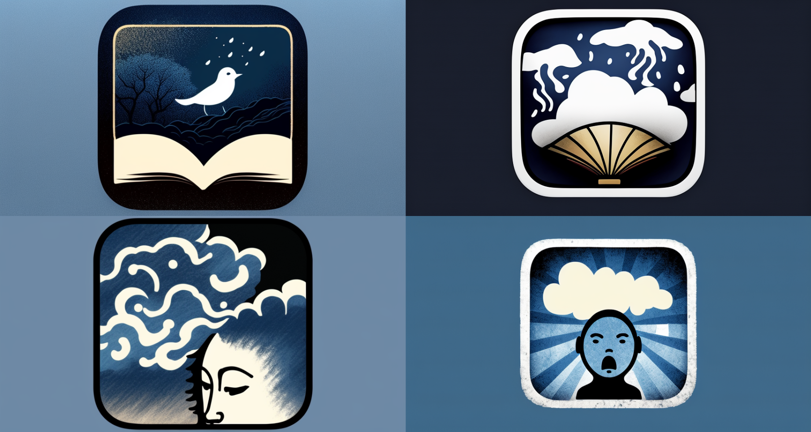

a girl is holding a flower and talking to someone, in the style of hauntingly beautiful illustrations, yellow and amber, mamiya 7 ii, childhood arcadias, delicate flowers, pseudo-realistic, portrait --ar 217:270

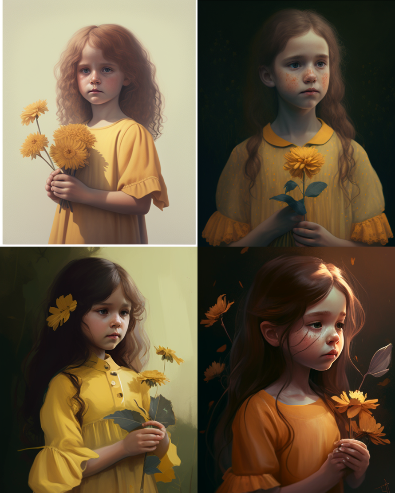

a girl in a blue top leaning against a pool, in the style of chinapunk, detailed facial features, light pink and dark amber, sharp focus, dolly kei, light white and light red, double tone effect --ar 4:5

wallpaper of a young man with blindfold on a yellow background, in the style of shige's visual aesthetic style, light pink and dark gray, lit kid, genderless, trick of the eye paintings, gongbi, honest portrayal

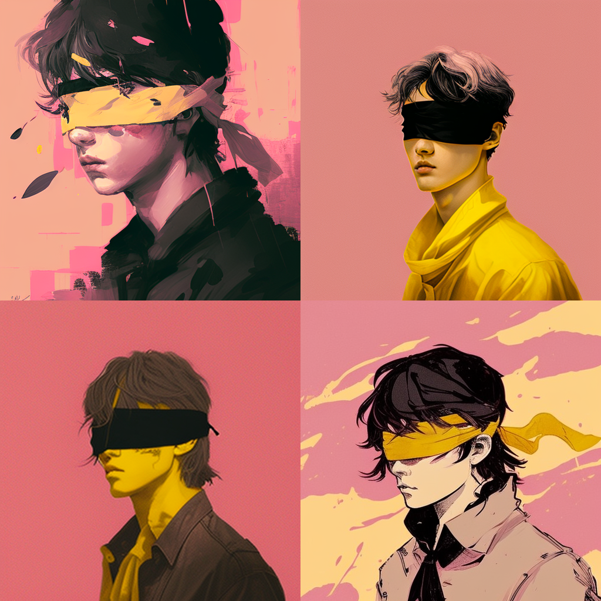

japan calendar widget'saikoho 0 8 12, in the style of romantic soft focus and ethereal light, studyplace, xu bing, digital as manual, use of precious materials, airy and light, happenings --ar 93:166

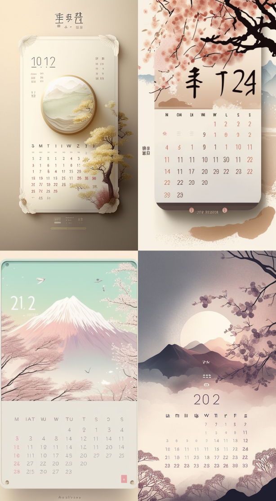

in the midst of winter found there was w, in the style of minimalist illustrator, humor meets heart, luminous sfumato, colored cartoon style, white and orange, whimsical children's book illustrator, gentle lyricism

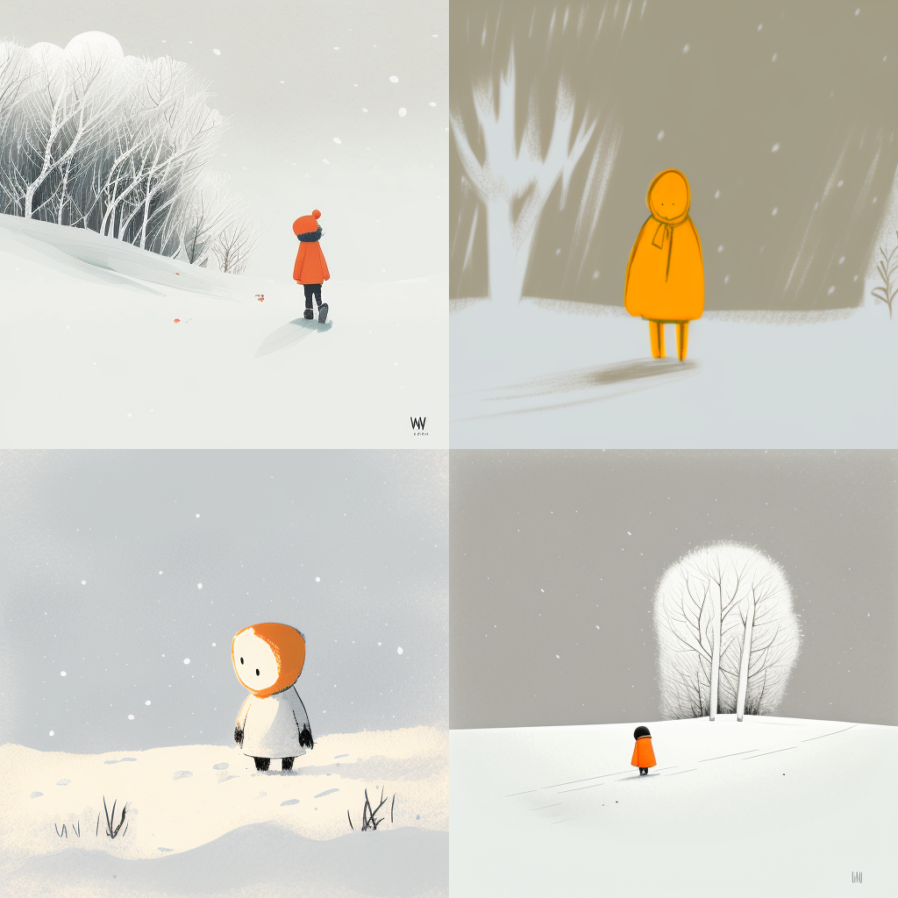

a guy looks up at a balloon in the snow, in the style of simplistic cartoon, dark white and orange, cute and dreamy, gray, avian-themed, sparse backgrounds, absurd doodle

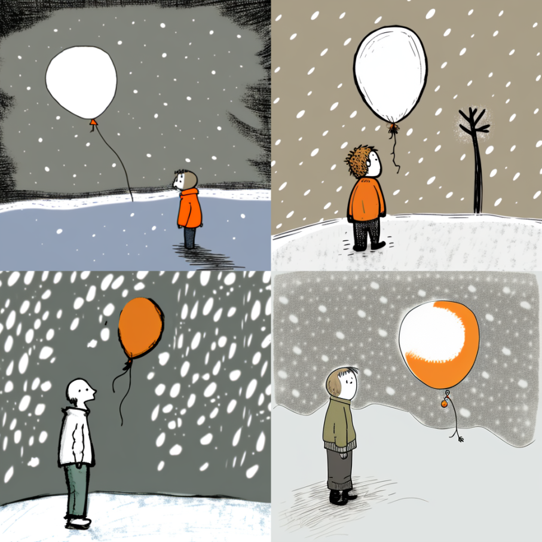

lofi retro art of a planet, matte paper background --ar 9:19

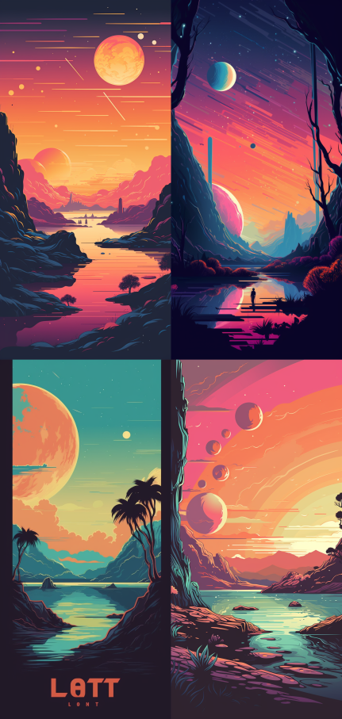

a girl in green and white clothing is flying between two green leaves, in the style of anime-inspired character designs, intricate embellishments, light white and light bronze, bold coloration, knightcore, loose and fluid, stone --ar 35:43

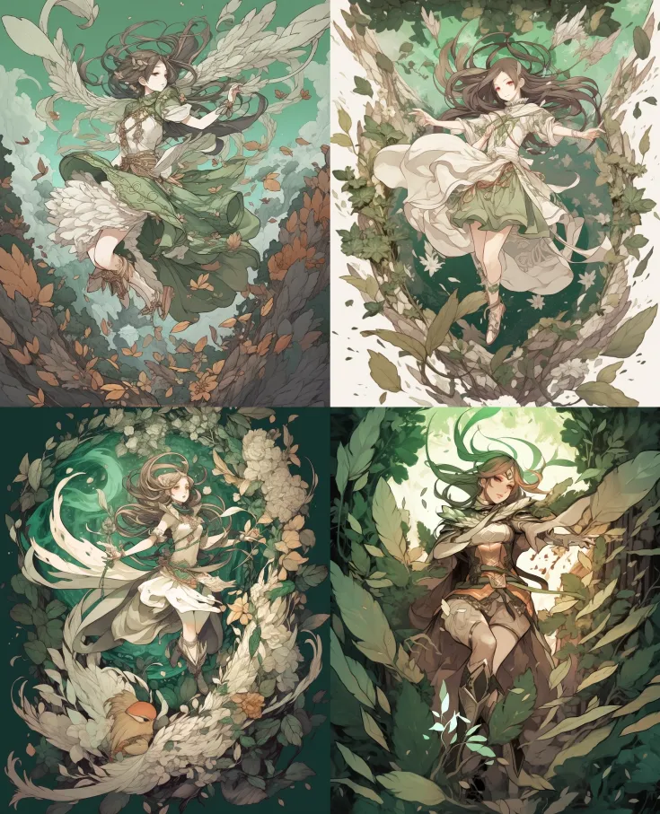

the man on the cover of the album'vina landa'is in the picture, in the style of frenzied action painting, the new fauves, neoclassical sculptures, the san francisco renaissance., patriotic, joyful chaos, precise nautical detail --q 2 --s 250 --niji 5

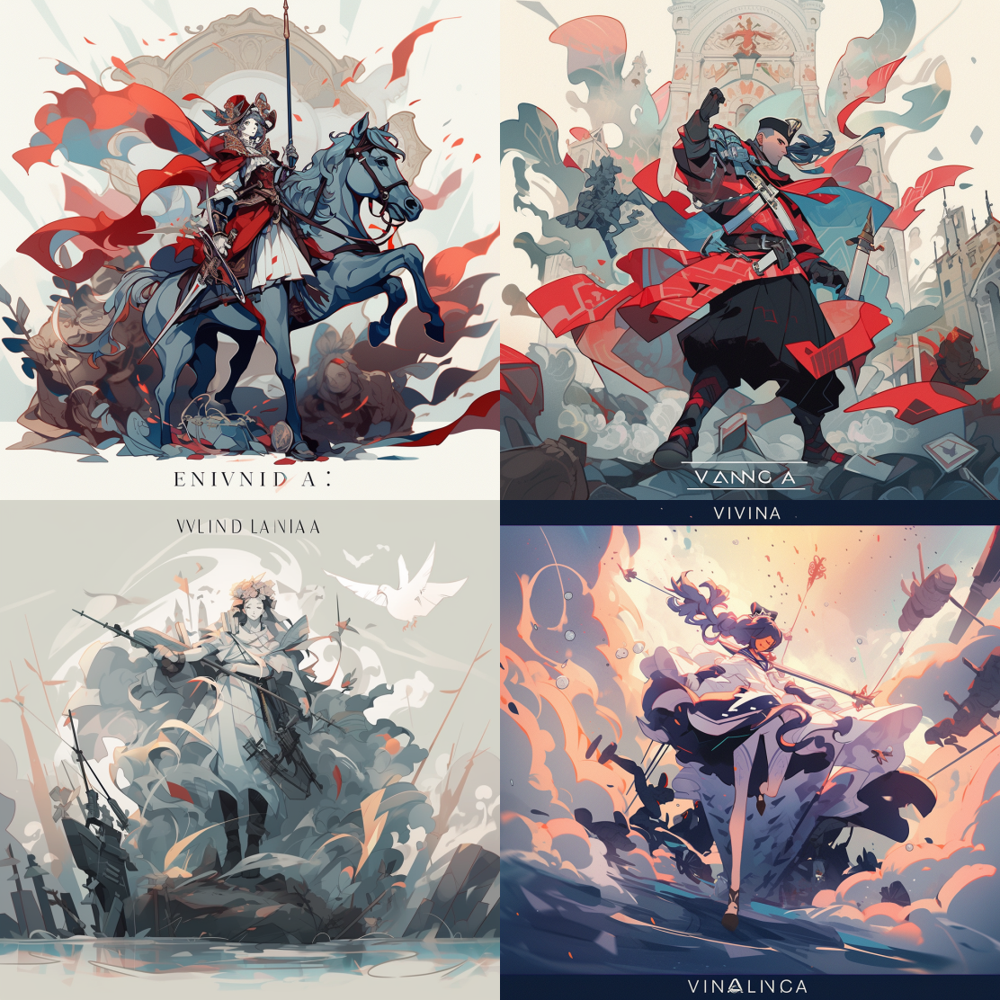

a small girl in the garden with birds, in the style of necronomicon illustrations, base prompt only, witchy academia, sketchfab, anime-inspired character designs, dark gray and light beige, traditional costumes --q 2 --s 250 --niji 5

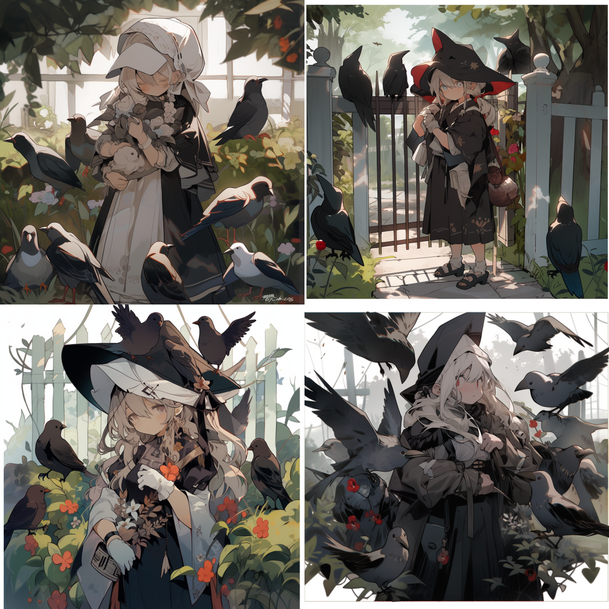

an illustration of a girl in a sitting room with cats, in the style of blue, whimsical floral scenes, timeless grace, children's book illustrations, outdoor art, bloomcore, murals and wall drawings --ar 85:113 --q 2 --niji 5

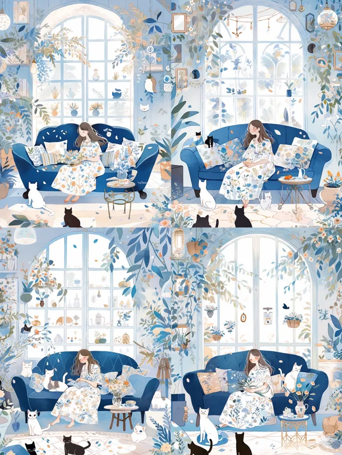
