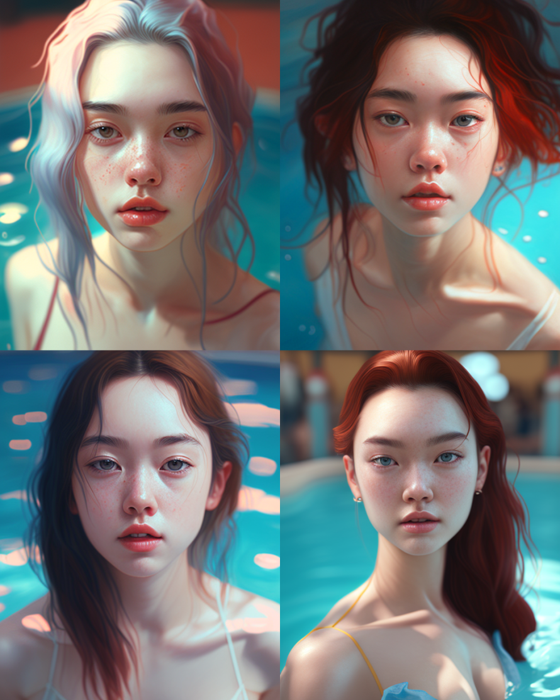

# awesome-midjourney

the app icon featuring an image of a voice on the screen, in the style of qing dynasty, dark sky-blue and light white, storybook-esque, quadratura, minimalist graphic designer, tachisme, printed social commentary --ar 15:8

a girl is holding a flower and talking to someone, in the style of hauntingly beautiful illustrations, yellow and amber, mamiya 7 ii, childhood arcadias, delicate flowers, pseudo-realistic, portrait --ar 217:270

a girl in a blue top leaning against a pool, in the style of chinapunk, detailed facial features, light pink and dark amber, sharp focus, dolly kei, light white and light red, double tone effect --ar 4:5

